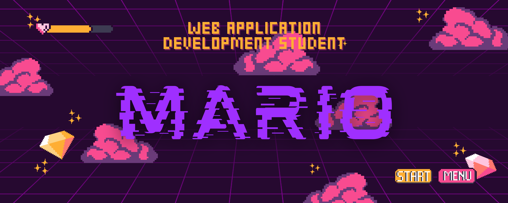

    
  </a>

    

<h1>¡¡¡Saludos✌!!! Soy Mario de Domingo Álvarez 💥 </h1> 

¡Hola! Soy Mario, estudiante de [**Desarrollo de Aplicaciones**](https://www.todofp.es/que-estudiar/loe/informatica-comunicaciones/des-aplicaciones-web.html), apasionado de la Música 🎵 y un fanático del cine🎬, especialmente de Marvel. Me encanta la magia del cine y cómo las películas pueden transportarnos a mundos imaginarios y emocionantes, y también, me fascina como la música es capaz de lograr que sintamos cosas indescriptibles.

    
Mi interés por el desarrollo de aplicaciones web surgió cuando descubrí la capacidad de utilizar la tecnología para crear experiencias interactivas y funcionales en línea🌐. Como estudiante de desarrollo de aplicaciones web💻, me emociona la idea de combinar mi amor por el cine y Marvel con mis habilidades técnicas. Me inspira cómo Marvel ha utilizado la tecnología👨‍💻 para crear experiencias interactivas y emocionantes para los fanáticos🎞️, como aplicaciones móviles📱 y sitios web interactivos.

Como un verdadero friki de Marvel me fascina el [**UCM**](marvel.com)🕸️ y cómo las diferentes películas se conectan📡 entre sí para crear una narrativa épica. Me encanta sumergirme en las historias de los superhéroes, sus poderes y los desafíos a los que se enfrentan🚀.

En resumen, soy Mario, un estudiante de Primero de [**D.A.W.**](https://www.todofp.es/que-estudiar/loe/informatica-comunicaciones/des-aplicaciones-web.html) entusiasta en el entro de educacion superior [**IES Luis Vives**](https://www.iesluisvives.es/) en [**Leganes**](https://www.google.com/maps/place/Legan%C3%A9s,+Madrid/@40.3280856,-3.7661991,14z/data=!3m1!4b1!4m6!3m5!1s0xd418a1c0fc4eac9:0xd08f90220cc34cb!8m2!3d40.3319506!4d-3.7686545!16zL20vMDJ3MTU4?entry=ttu) y ademas soy un gran fanático del cine🍿. Estoy emocionado por las oportunidades que el campo de la tecnología🛰️ me ofrece, y espero poder combinar mis dos pasiones para crear proyectos web innovadores y emocionantes que brinden experiencias únicas a los fanáticos del cine📽️ y de Marvel.👊

    

