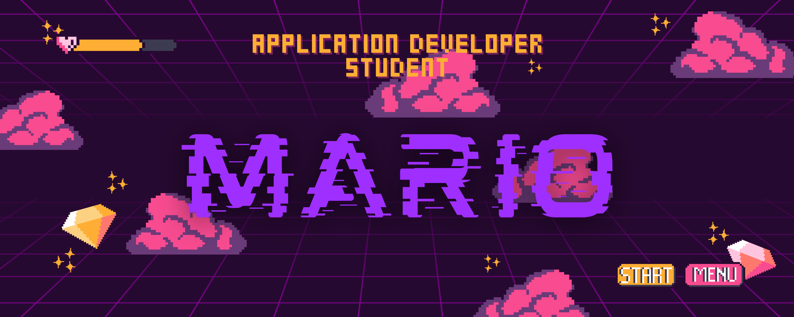
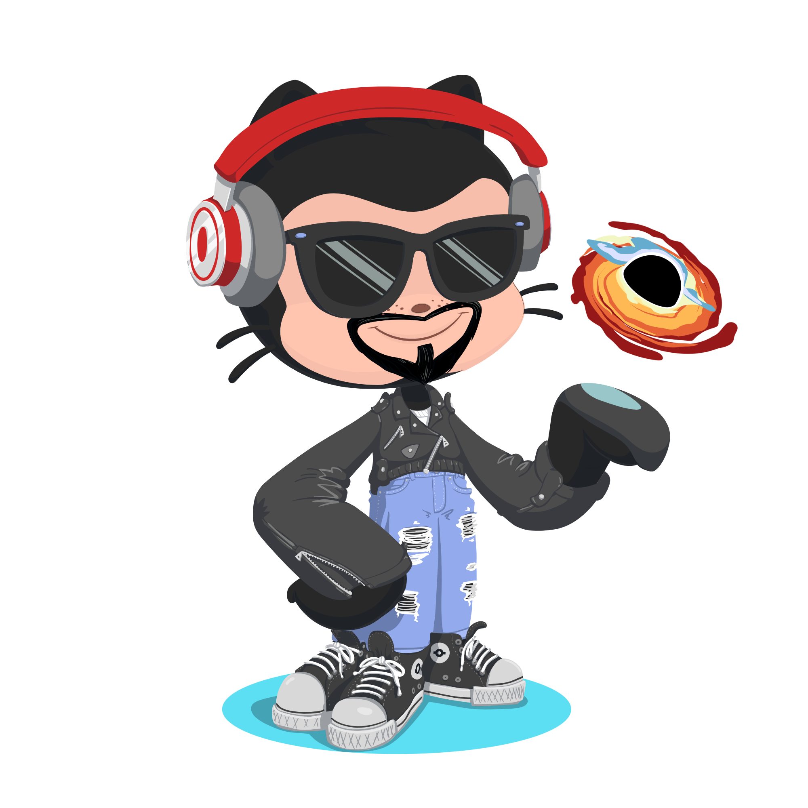
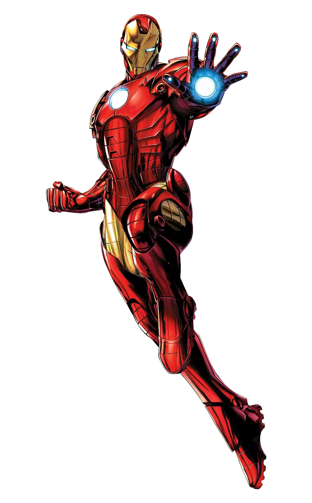
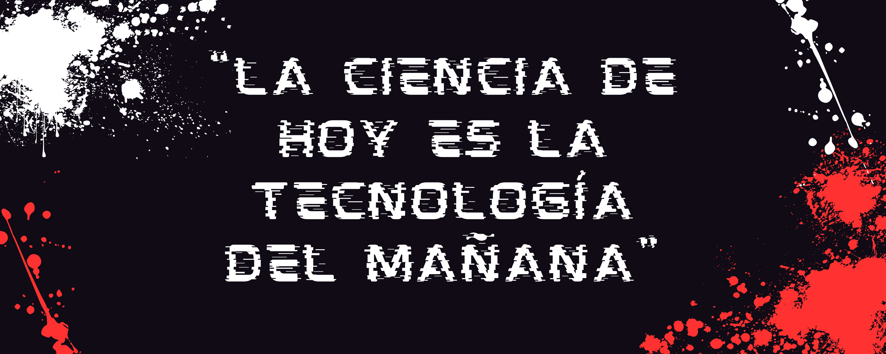

    
  </a>

<h1>¡¡¡Saludos✌!!! Soy Mario de Domingo Álvarez 💥 </h1> 

¡Hola! Soy Mario, estudiante de [**Desarrollo de Aplicaciones**](https://www.todofp.es/que-estudiar/loe/informatica-comunicaciones/des-aplicaciones-web.html) y un apasionado fanático del cine🎬, especialmente de Marvel. Me encanta la magia del cine y cómo las películas pueden transportarnos a mundos imaginarios y emocionantes.

    
Mi interés por el desarrollo de aplicaciones web surgió cuando descubrí la capacidad de utilizar la tecnología para crear experiencias interactivas y funcionales en línea🌐. Como estudiante de desarrollo de aplicaciones web💻, me emociona la idea de combinar mi amor por el cine y Marvel con mis habilidades técnicas. Me inspira cómo Marvel ha utilizado la tecnología👨‍💻 para crear experiencias interactivas y emocionantes para los fanáticos🎞️, como aplicaciones móviles📱 y sitios web interactivos.

Como un verdadero friki de Marvel me fascina el UCM🕸️ y cómo las diferentes películas se conectan📡 entre sí para crear una narrativa épica. Me encanta sumergirme en las historias de los superhéroes, sus poderes y los desafíos a los que se enfrentan🚀.

En resumen, soy Mario, un estudiante de desarrollo de aplicaciones web entusiasta y un gran fanático del cine🍿. Estoy emocionado por las oportunidades que el campo de la tecnología🛰️ me ofrece, y espero poder combinar mis dos pasiones para crear proyectos web innovadores y emocionantes que brinden experiencias únicas a los fanáticos del cine📽️ y de Marvel.👊

<h2>Frases iconicas de MARVEL</h2>

 -  “La única manera de avanzar, es retrocediendo”
 -  “Olvida el pasado, este es tu futuro”
 -  "Podría estar haciendo esto todo el día"
 -  “No tenemos porqué quedarnos aquí. Podemos ir adonde queramos”
 -  “Todos pasamos por eso ¿cierto? Permitir que el miedo y la ira nos domine, ampliar adrede los límites del mundo falso que creamos”
 -  “Yo no rompí sus reglas. Solo se doblegaron a mi poder”
 -  “¿Qué es la pena sino amor perseverante?”

    
  </a>

